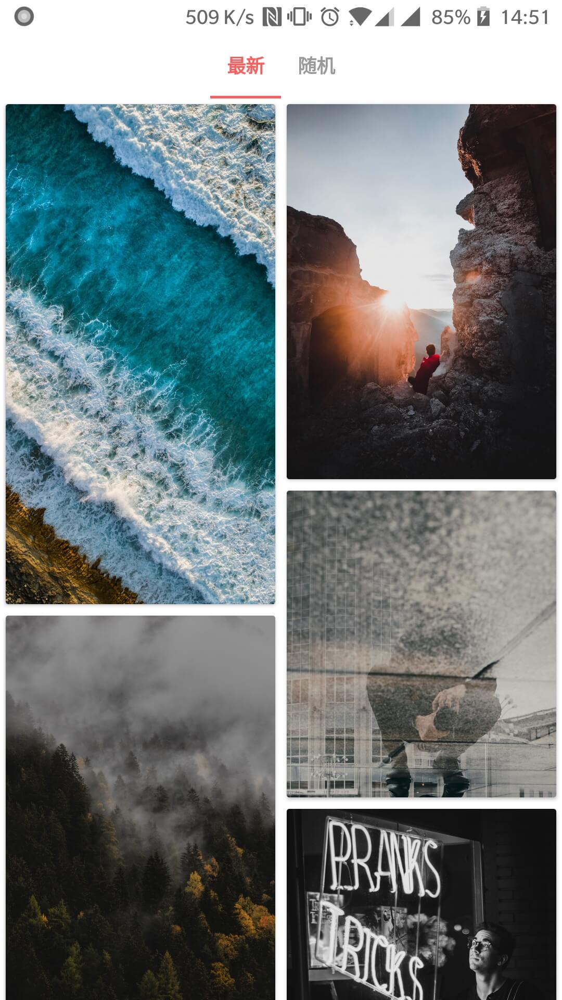
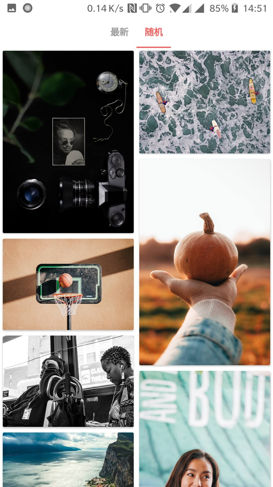
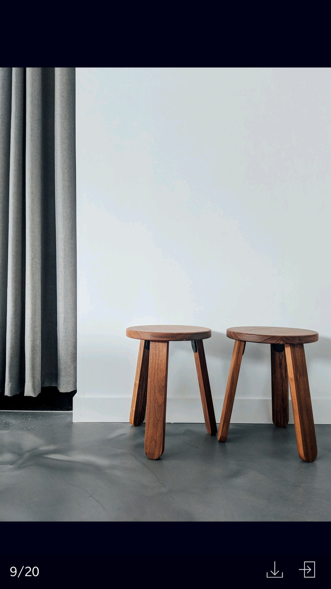

# U·Wallpaper
根据[unsplash](https://unsplash.com)提供的[接口](https://unsplash.com/developers)做的一个壁纸下载客户端

## 功能
* 这个是Kotlin的版本，是自己练手Kotlin用的。java版在[这里](https://github.com/zhoujia456888/Uwallpaper2)。
* 获取每日最新图片，提供图片下载和设置壁纸功能。  
* 支持随机图片的获取，让你每次刷新都有不同的感觉。
* 最多获取200张？其实应该不止，退出再进就可以再次获取。
* 调用的系统壁纸设置，不仅仅是设置壁纸，还能直接设置为联系人头像。
* 展示时加载的是接口提供的regular图，下载和设置壁纸是用的full图。
* 下载和设置壁纸是用的高清大图哦，所以可能下载会比较慢一点，耐心等待即可。

## 截图

   &nbsp;&nbsp;
   &nbsp;&nbsp;

## 下载

[apk下载地址](app/release/app-release.apk)

## 反馈
* 项目[提交Bug和建议](https://github.com/zhoujia456888/UwallpaperKotlin/issues)

## 感谢
* [butterknife](https://github.com/JakeWharton/butterknife)  
* [SmartRefreshLayout](https://github.com/scwang90/SmartRefreshLayout)
* [cardview](https://github.com/dandar3/android-support-v7-cardview)
* [AndroidUtilCode](https://github.com/Blankj/AndroidUtilCode)
* [Jlog](https://github.com/zhoujia456888/JLog)
* [gson](https://github.com/google/gson)
* [unsplash](https://github.com/KeenenCharles/AndroidUnplash)
* [SmartTabLayout](https://github.com/ogaclejapan/SmartTabLayout)
* [fresco-helper](https://github.com/hpdx/fresco-helper)
* [material-dialogs](https://github.com/afollestad/material-dialogs)
* [Cockroach](https://github.com/android-notes/Cockroach)
* [BaseRecyclerViewAdapterHelper](https://github.com/CymChad/BaseRecyclerViewAdapterHelper)
* [BRVAH_kotlin](https://github.com/AllenCoder/BRVAH_kotlin)

